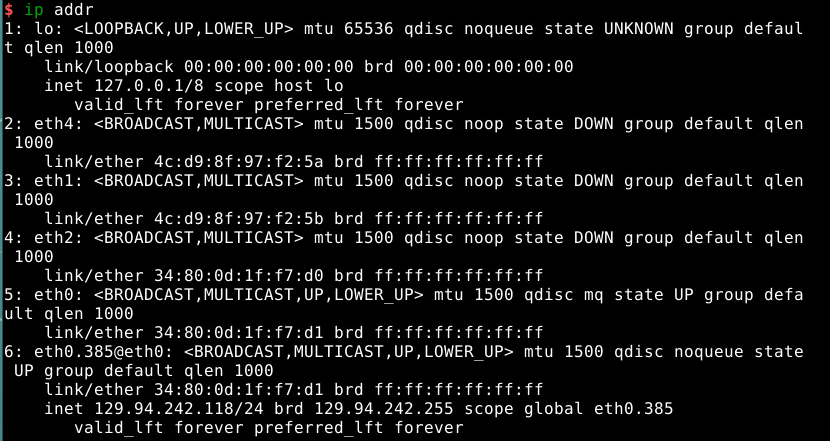
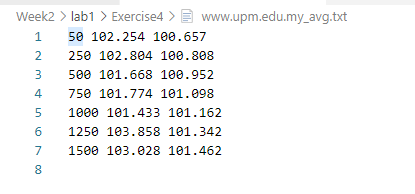

# Lab1

[TOC]

## Exercise 1: nslookup

### 1.1

**The IP address is :**

* `172.67.219.46`
* `104.18.60.21`
* `104.18.61.21`

In my opinion, several IP addresses can help server or website to reduce load. For example, in an instant, there are a large number visits in this website and several IP addresses could help or reduce the load than using one IP address.

### 1.2

The name of the IP address `127.0.0.1` is `localhost'.

`127.0.0.1` is a local IP address and it is used for loopback.Each machine or computer has this special address and can only visit this address by itself, in other words, the other machine cannot visit this address.

It always uses for testing purpose. For example, try to `ping 127.0.0.1` can test if you set network properly by checking if the network can send or receive packets. 

## Exercise 2: Use ping to test host reachability

|Website| ping if reachable | Reason | Reachable from Web browser |
|----|----|----|----|-----|
|www.unsw.edu.au| Reachable | | Reachable |
|www.getfittest.com.au | Unreachable | Unknown host. Maybe it is not a exist website, cannot visit | Unreachable |
|www.mit.edu|Reachable| | Reachable|
|www.intel.com.au|Reachable| | Reachable|
|www.tgp.com.au|Reachable| | Reachable |
|www.telstra.com.au|Reachable| | Reachable|
|www.hola.hp|Unreachable| Unknown host, may be this website do not exist | Unreachable |
|www.amazon.com|Reachable| | Reachable|
|www.tsinghua.edu.cn|Reachable| |Reachable|
|www.kremlin.ru|Unreachable | Request time out | Reachable|
|8.8.8.8|Reachable| | Unreachable|

## Exercise 3: Use traceroute to understand network topology

### 3.1

#### How many routers are there between your workstation and www.columbia.edu ? 
22

#### How many routers along the path are part of the UNSW network?

4 (1, 3, 4, 5)

#### Between which two routers do packets cross the Pacific Ocean? 

Between 9 and 10

### 3.2

#### i) www.ucla.edu

#### ii) www.u-tokyo.ac.jp

#### iii) www.lancaster.ac.uk

#### At which router do the paths from your machine to these three destinations diverge? 

`138.44.5.0`, diverge after this router to three different destinations

#### Find out further details about this router. 

**running `whois 138.44.5.0`**

 

**We can get this router belongs to APNIC and more details in the screenshot above**

####  Is the number of hops on each path proportional the physical distance?

 
 

|Uni|Num of hops|physical distance|
|---|---|---|
|UCLA|15|7499.0 miles|
|u-tokyo|15|4908.7 miles|
|lancaster|14|10572.2 miles|

**Thus, it seems that the number of hops is not proportional the physical distance.**

### 3.3

`129.94.242.118` is my machine's IP address

#### test1

##### traceroute from  http://www.speedtest.com.sg to my machine

##### traceroute from my meachine to www.speedtest.com.sg

#### test2

##### traceroute from http://www.telstra.net/ to my machine

#### traceroute from my machine to www.telstra.net

#### What are the IP addresses of the two servers that you have chosen

Using `traceroute` and this command will directly show the IP addresses which we will visit. Then using `nslookup` to make sure that is right IP address.

For example:

 

Therefore, I choose `203.50.5.178` and `202.150.221.170`

My machine IP address is `129.94.242.118` which i mentioned before.

#### Does the reverse path go through the same routers as the forward path? If you observe common routers between the forward and the reverse path, do you also observe the same IP addresses? Why or why not?

* From the screenshot, we can get the reverse path do not go through the same routers as the forward path. 
* Do not see the same routers between the forward and reverse path.
* Same, do not see the same IP address.

In my opinion, different routers have different forwarding table, if the first routers is not the same, the switch routers will jump to different routers.

## Exercise 4

### 4.1

|Host|Distance|Min Delay|Shortest Time|Ratio = Minium Delay / Shortest time|
|---|---|---|---|---|
|www.uq.edu.au|733.8 km|16.935|2.446 ms|6.92|
|www.upm.edu.my|4116.5 miles = 6624.86 km|100.657|22.08 ms|4.55|
|www.tu-berlin.de|10013.1 miles = 16114.52 km|281.883|53.72 ms|5.25|

#### Can you think of at least two reasons why the y-axis values that you plot are greater than 2?

The y-axis = Minimum Delay / Shortest Time

Delay is the time including send time and receive time.
Ideally, Minimum Delay is twice as Shortest time. But in reality, the y-axis values is always greater than 2

* the first reason, the distance between two routers is not the shortest distance which search in google. In practice, it must be longer than it.
* Then, the different area has different transmission medium or different materials. It will result in different speed
* There are other delay, like transmission delay, queueing delay and processing delay.

### 4.2

#### Is the delay to the destinations constant or does it vary over time? Explain why

The delay to the destinations varies over time. There are different delay when machine send or receive packets and each time may be different, for example, if traffic happens the delay will be larger.

### 4.3 

#### Explore where the website for www.epfl.ch is hosted. Is it in Switzerland?

 

It is not in Switzerland. 

This IP belongs to Cloudflare, the country is US.

### 4.4

#### The measured delay (i.e., the delay you can see in the graphs) is composed of propagation delay, transmission delay, processing delay and queuing delay. Which of these delays depend on the packet size and which do not?

|propagation delay|transmission delay|processing delay|queueing delay|
|--|--|--|--|
|Do not depends on|Depend on|Depend on|Do not depend on|

* Propagation delay cause by distance between two routers and the material of the wired.
* Queueing delay is up to how many packets.

### Materials in Exercise 4

#### www.uq.edu.au
  

#### www.upm.edu.my

  

#### www.tu-berlin.de

  
